# 🩺 MediBook — Doctor Appointment Booking System

> Book your serial, skip the queue.

A fully offline Flutter application that lets patients discover doctors, book appointments through an **automated serial-based scheduling system**, and check diagnostic test and medicine prices — all without a phone call and without an internet connection.

<p align="left">
  
  
  
  
  
</p>

---

## 📑 Table of Contents

- [Academic Information](#-academic-information)
- [Problem Statement](#-problem-statement)
- [The Solution](#-the-solution)
- [How the Serial System Works](#-how-the-serial-system-works)
- [Features](#-features)
- [Screenshots](#-screenshots)
- [Tech Stack](#-tech-stack)
- [Folder Structure](#-folder-structure)
- [Course Concepts Demonstrated](#-course-concepts-demonstrated)
- [Getting Started](#-getting-started)
- [Demo Video](#-demo-video)
- [Design Decisions](#-design-decisions)
- [Limitations & Future Scope](#-limitations--future-scope)

---

## 🎓 Academic Information

| | |
|---|---|
| **Course** | Mobile App Development Practice Lab |
| **Course Code** | SWE-422 |
| **Submitted to** | Md. Zia Uddin Khan, Adjunct Faculty |
| **Department** | Software Engineering, Metropolitan University, Sylhet |
| **Submitted by** | Tamim Amin Suhag |
| **Student ID** | 232-134-024 |
| **Batch** | 5th |
| **Submission Date** | 21 August 2026 |

---

## ❗ Problem Statement

Booking a doctor's appointment in Bangladesh is still a manual, offline process, and it creates several recurring problems:

1. **No single place to search doctors.** Patients rely on word of mouth or scattered clinic phone numbers, with no way to filter by specialty *and* by which day the doctor actually sits.
2. **Phone-based booking is unreliable.** Serials are taken over the phone or in person; lines are busy, receptionists are unavailable outside office hours, and there is no written confirmation.
3. **Long, unpredictable waiting.** Even after getting a serial, patients have no idea when their turn will come, so they arrive early and wait for hours in a crowded chamber.
4. **Overbooking.** Without a hard daily limit, chambers accept more patients than the doctor can realistically see.
5. **Hidden cost of tests and medicine.** Patients cannot compare diagnostic prices before visiting, making it hard to plan a limited health budget.

---

## 💡 The Solution

MediBook puts doctor discovery, availability-aware filtering, automatic serial allocation with an estimated arrival time, a capacity-limited booking system, and transparent diagnostic pricing into a single mobile app.

**Three things make it different from a generic booking app:**

| | |
|---|---|
| 🎫 **Instant serial, no approval step** | No doctor-side accept/reject. Booking auto-confirms and issues a serial immediately. |
| ⏰ **Estimated arrival time** | Every patient is told roughly *when* to reach the chamber, not just *that* they have a booking. |
| 🚫 **Hard daily limits** | Booking closes automatically once the doctor's daily patient limit is reached — no overbooking. |

Guests can browse everything freely; an account is only required at the moment of booking.

---

## 🧮 How the Serial System Works

This is the core of the project.

Each doctor has four scheduling properties: **available days**, a **start time**, an **average consultation duration**, and a **daily patient limit**.

```
issuedCount    = every serial ever issued for this doctor on this date
                 (cancelled ones included)

nextSerial     = issuedCount + 1
estimatedTime  = startTime + (serial − 1) × consultMinutes
isFull         = issuedCount >= dailyLimit
```

### Worked example — Dr. Srijon Roy

> Sits Mon / Wed / Fri · starts **5:00 PM** · **15 min** per patient · limit **20**

| Serial | Estimated arrival |
|:---:|:---|
| #1 | 5:00 PM |
| #2 | 5:15 PM |
| #3 | 5:30 PM |
| #10 | 7:15 PM |
| #20 | 9:45 PM → **booking closes** |

Serials are counted **per doctor, per day** — the same doctor on a different date starts again at #1.

### Why cancelled serials still count

Cancelling **never renumbers the queue**. If patient #3 cancels, patient #4 keeps serial 4 and their original arrival time — nobody has to be told their slot moved. The trade-off is that a cancelled slot is not resold, which mirrors a real chamber: the doctor's session is a fixed length regardless of who turns up.

Counting only *active* bookings would break the system — the next patient would be handed serial 4 while an existing serial 4 was already out there.

**Reschedule = cancel + fresh booking.** The old day's slot stays consumed and the patient receives a brand new serial and time on the new day.

---

## ✨ Features

### Onboarding & Access
- **One-time onboarding carousel** — 3 slides, shown only on first launch via a SharedPreferences flag
- **Guest browsing** — search doctors and diagnostics without an account
- **Conditional login gate** — logging in is only required at the point of booking, and returns the user straight back into the booking flow
- **Register / Login** with full form validation and a persisted session

### Doctor Discovery
- **Home** — time-aware greeting, gradient hero banner, 10 specialty categories with live doctor counts, and Top Doctors by rating
- **Live search** by doctor name, specialty or hospital
- **Combined filtering** — specialty **AND** available day narrow the list together
- **Doctor profile** — bio, rating, experience, fee, chamber, available days, start time, per-patient duration and daily limit
- **Favourites** — heart any doctor; the list persists across restarts
- **Skeleton loaders** on every data-loading screen

### Appointment Booking
- **Availability-aware date picker** — only days the doctor actually sits are selectable
- **Serial preview before committing** — see your serial number, estimated arrival and remaining slots *before* confirming
- **Patient details form** with validation (name, age, contact, problem description)
- **Automatic closure** when the daily limit is reached — the form disables and explains why
- **Confirmation screen** with the full serial badge and every booking detail

### Appointment Management
- **My Appointments** — Upcoming / History tabs with live counts
- **Details bottom sheet** — serial badge, appointment info, patient info and the reported problem
- **Cancel** with a confirmation dialog that explains the no-renumbering policy
- **Reschedule** — reuses the booking screen, cancels the old serial and issues a new one

### Diagnostics & Pharmacy
- **8 Sylhet diagnostic centres** with location, rating and opening hours
- **Centre details** with two tabs — **Tests** (with context-aware icons) and **Pharmacy** — and full price lists

### Experience & Settings
- **Notifications** — appointment reminders generated live from your bookings, with a badge count and Today / Tomorrow highlighting
- **Dark mode** — full theme support, persisted
- **Edit profile** — update name, phone and age; saved details pre-fill future booking forms
- **Empty states everywhere** — no blank screens, ever
- **Works fully offline** — no internet permission needed at any point

---

## 📸 Screenshots

<!--
HOW TO ADD YOUR SCREENSHOTS
1. Create a folder named `screenshots` in the project root.
2. Save your images there using EXACTLY the filenames below.
3. That's it — the tables render automatically. Delete any row you don't have.
-->

### Onboarding & Authentication

| Onboarding | Welcome | Login |
|:---:|:---:|:---:|
| 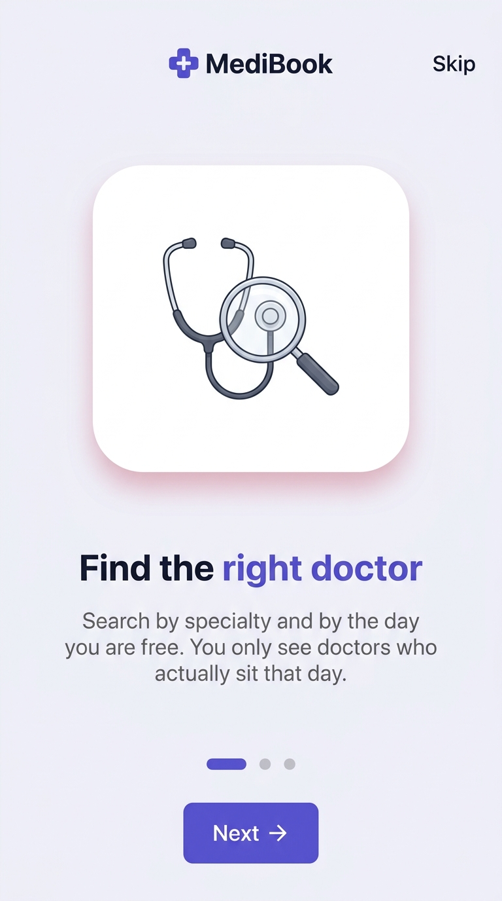 | 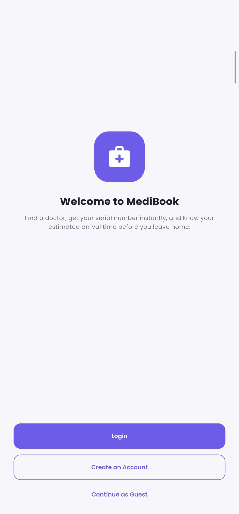 | 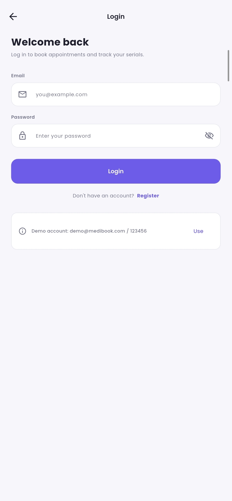 |

### Discovery

| Home | Filtered Listing | Doctor Profile |
|:---:|:---:|:---:|
| 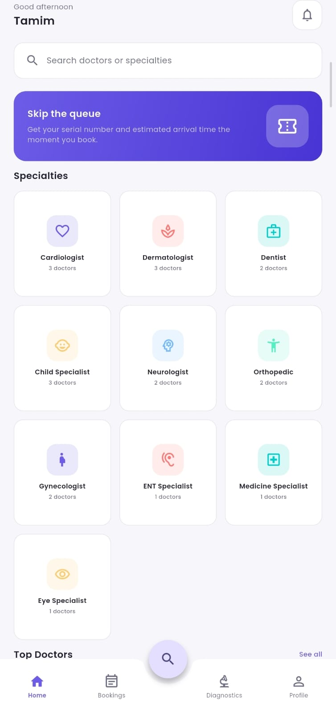 | 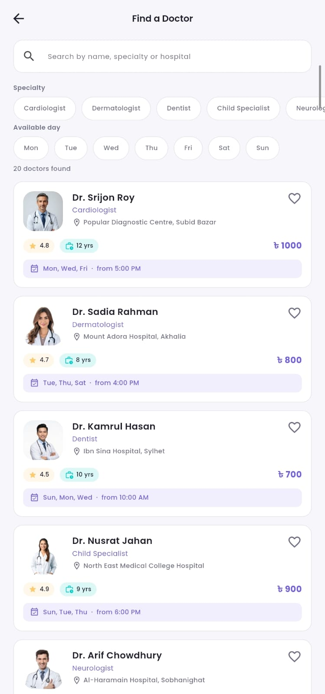 | 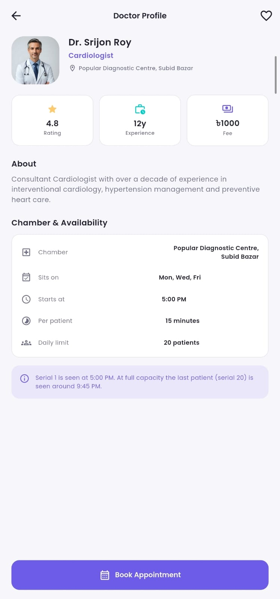 |

### Booking — the core flow

| Serial Preview | Confirmation |
|:---:|:---:|:---:|
| 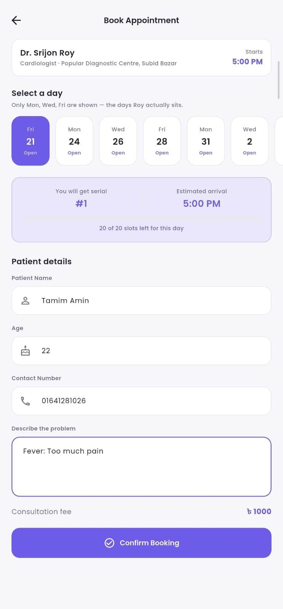 |  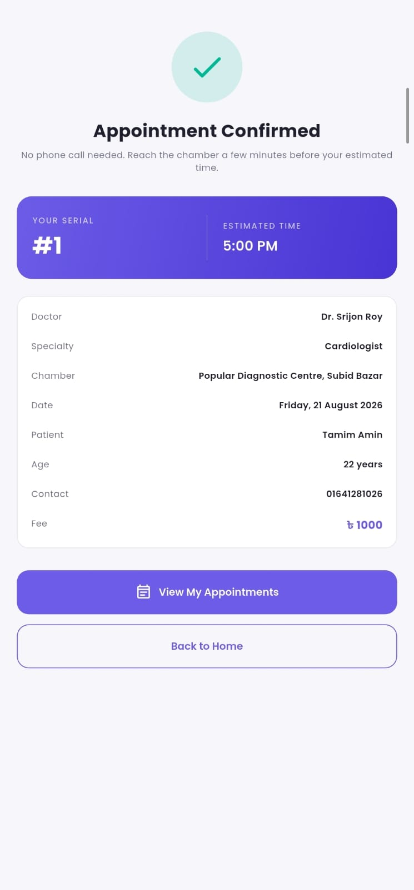 |

### Management & Extras

| My Appointments | Diagnostics | Dark Mode |
|:---:|:---:|:---:|
| 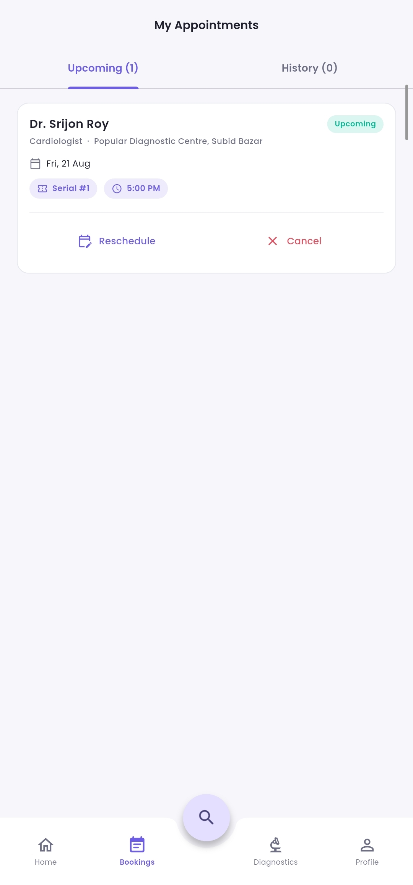 | 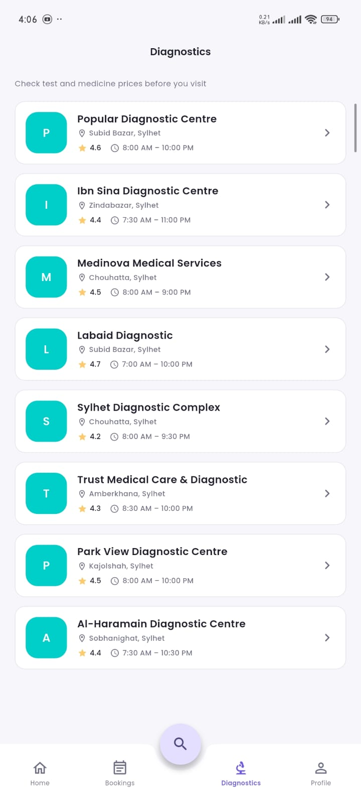 | 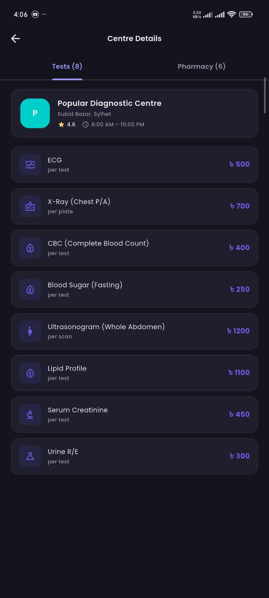 |

<!--
OPTIONAL EXTRA ROW — uncomment if you capture these:

| Notifications | Favourites | Edit Profile |
|:---:|:---:|:---:|
|  |  |  |
-->

---

## 🛠 Tech Stack

| Layer | Choice | Why |
|---|---|---|
| **Framework** | Flutter 3.x / Dart 3.x | Cross-platform from a single codebase |
| **State management** | `provider` | Course requirement; the right weight for this app's scope |
| **Local storage** | `shared_preferences` | Key-value persistence, no backend needed |
| **Date & time** | `intl` | Locale-aware formatting for serial times and dates |
| **Loading states** | `shimmer` | Skeleton placeholders during simulated async loads |
| **Backend** | *None* | Fully offline by design |

---

## 📁 Folder Structure

```
lib/
├── main.dart                    # Entry point, MultiProvider, route table
│
├── models/                      # Plain data classes
│   ├── doctor.dart              # + scheduling helpers (estimatedTimeForSerial)
│   ├── appointment.dart         # + toJson / fromJson (persisted)
│   ├── diagnostic_center.dart
│   ├── price_item.dart
│   └── app_user.dart            # + toJson / fromJson (persisted)
│
├── providers/                   # ChangeNotifier state
│   ├── auth_provider.dart       # register, login, logout, session
│   ├── doctor_provider.dart     # doctor list, search + combined filters
│   ├── appointment_provider.dart# ⭐ serial engine, booking, cancel, reschedule
│   ├── favorites_provider.dart  # favourite doctor IDs
│   └── theme_provider.dart      # dark mode
│
├── screens/
│   ├── splash_screen.dart       # bootstraps every provider, then routes
│   ├── main_shell.dart          # bottom nav + notched FAB
│   ├── onboarding/
│   ├── auth/                    # welcome, login, register
│   ├── home/                    # home + notifications sheet
│   ├── doctors/                 # listing, profile
│   ├── booking/                 # booking form, confirmation
│   ├── appointments/            # upcoming/history, details sheet
│   ├── diagnostics/             # centre list, centre details
│   └── profile/                 # profile, edit profile, favourites
│
├── widgets/                     # Reusable custom widgets
│   ├── doctor_card.dart
│   ├── appointment_card.dart
│   ├── serial_badge.dart
│   ├── diagnostics_price_card.dart
│   ├── skeleton_loader.dart
│   ├── empty_state_view.dart
│   ├── category_tile.dart
│   ├── center_card.dart
│   ├── date_selector.dart
│   ├── app_text_field.dart
│   ├── primary_button.dart
│   ├── section_header.dart
│   └── avatar_image.dart
│
├── data/                        # Static demo data
│   ├── demo_doctors.dart        # 20 doctors, 10 specialties
│   └── demo_diagnostics.dart    # 8 Sylhet diagnostic centres
│
└── utils/                       # Cross-cutting helpers
    ├── app_colors.dart
    ├── app_text_styles.dart
    ├── app_theme.dart           # light + dark ThemeData
    ├── app_routes.dart          # every named route in one place
    ├── prefs_keys.dart          # every SharedPreferences key in one place
    ├── context_colors.dart      # theme-aware colour extension
    ├── time_utils.dart          # ⭐ the estimated-arrival formula
    └── validators.dart          # shared form validation rules
```

---

## 🎯 Course Concepts Demonstrated

| Concept | Where it lives | What it does |
|---|---|---|
| **Navigation** | `utils/app_routes.dart`, `main.dart`, `screens/main_shell.dart` | 14 named routes, typed route arguments, bottom navigation with `IndexedStack`, notched centre FAB |
| **Forms & Validation** | `utils/validators.dart`, `widgets/app_text_field.dart` | Register, login, booking and edit-profile forms; shared validators for email, BD phone format, age, password match |
| **Provider** | `providers/` (5 providers) | Auth session, doctor filtering, appointments, favourites and theme — all app-wide reactive state |
| **SharedPreferences** | `utils/prefs_keys.dart` + every provider | Onboarding flag, login session, registered users, favourites, appointments, dark mode |
| **Custom Widgets** | `widgets/` (13 widgets) | `DoctorCard`, `AppointmentCard`, `SerialBadge`, `DiagnosticsPriceCard`, `SkeletonLoader`, `EmptyStateView` and more |
| **PageView / TabBar** | `onboarding_screen.dart`, `appointments_screen.dart`, `center_details_screen.dart` | Onboarding carousel; Upcoming/History and Tests/Pharmacy tabs |
| **Async & Loading States** | All providers + `skeleton_loader.dart` | Simulated `Future.delayed` fetches with shimmer skeletons and pull-to-refresh |
| **Clean Architecture** | Folder structure above | Models / providers / screens / widgets / data / utils, with no business logic inside widgets |

---

## 🚀 Getting Started

### Prerequisites
- Flutter SDK 3.x ([install guide](https://docs.flutter.dev/get-started/install))
- An Android emulator or a physical device
- On Windows: **Developer Mode enabled** (required for plugin symlink support)

### Run

```bash
git clone https://github.com/Tamim-Amin/medibook.git
cd medibook
flutter pub get
flutter run
```

### 🔑 Demo Account

A ready-made account is seeded on first launch so the app can be tested without registering:

```
Email:    demo@medibook.com
Password: 123456
```

The login screen has a **Use** button that fills this in automatically.

### Suggested test walkthrough

1. Skip onboarding → **Continue as Guest** → browse freely
2. Filter **Dermatologist + Tuesday** → note how results narrow
3. Open a doctor → tap **Book Appointment** → the login gate appears
4. Log in → you land straight back in the booking form
5. Book twice on the same day → watch serials go **#1 → #2** with the time advancing
6. Try **Dr. Arif Chowdhury** (daily limit 12) and fill his day to see booking close
7. Cancel a booking, then rebook — the cancelled serial is never reused
8. Turn on **airplane mode** — everything still works

---

## 🎬 Demo Video

**▶️ [Watch the 3-minute demo](PASTE_YOUR_VIDEO_LINK_HERE)**

<!-- Replace the link above with your Google Drive / YouTube (unlisted) URL -->

| Time | Covered |
|---|---|
| 0:00 – 0:20 | Introduction and the problem |
| 0:20 – 0:50 | Onboarding → guest browsing |
| 0:50 – 1:20 | Search, combined filters, doctor profile, favourites |
| 1:20 – 2:20 | Booking flow — login gate, serial allocation, estimated time |
| 2:20 – 2:50 | Cancel / reschedule, diagnostics pricing |
| 2:50 – 3:20 | Dark mode and a short code walkthrough |

---

## 🧠 Design Decisions

Choices made deliberately, with the reasoning behind them:

**Serial allocation counts cancelled bookings.**
Explained in full [above](#-how-the-serial-system-works). The alternative would allow two patients to hold the same serial number.

**Appointments store a snapshot of the doctor, not just an ID.**
`Appointment` copies the doctor's name, specialty, chamber and fee at booking time. Past appointments stay readable even if doctor data changes, and no lookup is needed on every list rebuild.

**Doctors and diagnostic centres are not serialisable.**
They are static demo data that nothing ever writes back. Only `Appointment` and `AppUser` implement `toJson` / `fromJson`.

**Filtering lives in the provider, not in screens.**
Search, specialty and day are three pieces of state combined in one place, so Home and the listing screen can never disagree about what "Dermatologist on Tuesday" means.

**Diagnostics has no provider.**
That data is read-only and never mutated, so a local loading flag is enough — a provider would be extra structure for nothing.

**Email is read-only on Edit Profile.**
`updateProfile()` matches the stored account by email; allowing a change would orphan the record.

**Notifications are derived, not stored.**
With no push service, reminders are generated on the fly from upcoming appointments — nothing extra to persist or keep in sync.

---

## ⚠️ Limitations & Future Scope

### Current limitations
- Data is stored **locally only** — nothing syncs between devices
- Passwords are stored in plain text in SharedPreferences (acceptable for an offline course demo; a production app would hash them or use a managed auth service)
- Doctor and diagnostic data is static demo content, not fetched from a server
- All doctor names, fees, ratings, chamber timings and test prices are **fictional sample data** created for this project. Hospital and diagnostic centre names are real Sylhet institutions used only for realism — no actual schedule or price is represented.

### Future scope
The architecture was built so a backend can be added without restructuring:

- **Firebase Authentication** in place of local auth
- **Cloud Firestore** for real-time bookings and multi-device sync
- **A doctor/admin dashboard** to manage chambers, limits and schedules
- **Push notifications** for real appointment reminders
- **Live queue tracking** — "the doctor is currently seeing serial #7"
- **Online payment** for consultation fees

---

<p align="center">
  Built with Flutter for SWE-422 · Metropolitan University, Sylhet
</p>
